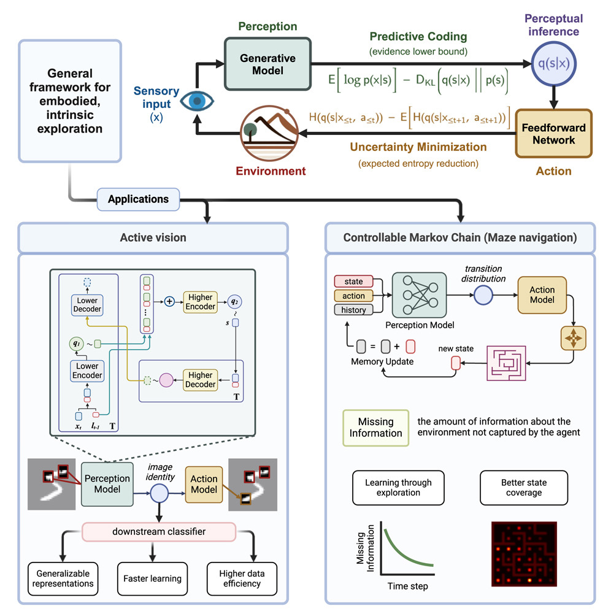

# Active Sensing with Predictive Coding and Uncertainty Minimization

by
Abdelrahman Sharafeldin,
Nabil Imam,
and Hannah Choi.

This repository is the official implementation of our Patterns paper [Active Sensing with Predictive Coding and Uncertainty Minimization](https://www.cell.com/patterns/fulltext/S2666-3899(24)00097-7).

In this paper, we developed an end-to-end perception-action framework for embodied exploration based on two theories from computational neuroscience: predictive coding for perception and uncertainty minimization for action. We apply this framework to two exploration settings: discrete-action Controllable Markov Chains (CMCs), and continuous-action active vision tasks. 

* **Graphical Abstract**. Generative models and architectures for the active exploration agents in CMCs and active vision. In both cases, the perception model aims to optimize the ELBO of a generative model that reflects the nature of the task, while the action model selects actions in an intrinsically-motivated manner to minimize the uncertainty of the perception model.*

## Abstract

We present an end-to-end procedure for embodied exploration inspired by two biological computations: predictive coding and uncertainty minimization. The procedure can be applied to exploration settings in a task-independent and intrinsically driven manner. We first demonstrate our approach in a maze navigation task and show that it can discover the underlying transition distributions and spatial features of the environment. Second, we apply our model to a more complex active vision task, where an agent actively samples its visual environment to gather information. We show that our model builds unsupervised representations through exploration that allow it to efficiently categorize visual scenes. We further show that using these representations for downstream classification leads to superior data efficiency and learning speed compared to other baselines while maintaining lower parameter complexity.  Finally, the modularity of our model allows us to probe its internal mechanisms and analyze the interaction between perception and action during exploration.

## Software implementation

All code is written in Python using [PyTorch](pytroch.org). Our active sensing algorithms for CMC exploration and active vision are implemented in the `agents` folder. All tasks are implemented as [Gym](https://www.gymlibrary.dev/index.html) environments and are included in the `envs` folder. All components of our CMC exploration agent are in one file [`agents/cmc_explorer`](./agents/cmc_explorer.py). The components of the active vision model are implemented in the `models` folder. Scripts used to train the various models and baselines are included in the `scripts` folder.

## Getting the code

You can download a copy of all the files in this repository by cloning the
[git](https://git-scm.com/) repository:

    git clone https://github.com/AbdoSharaf98/active-sensing-paper.git

or [download a zip archive](https://github.com/AbdoSharaf98/active-sensing-paper/archive/refs/heads/main.zip).

## Dependencies

You'll need a working Python environment to run the code.
The recommended way to set up your environment is through the
[Anaconda Python distribution](https://www.anaconda.com/download/) which
provides the `conda` package manager.
Anaconda can be installed in your user directory and does not interfere with
the system Python installation.

We use `conda` virtual environments to manage the project dependencies in
isolation.
Thus, you can install our dependencies without causing conflicts with your
setup (even with different Python versions).

First, create a conda environment by running:

    conda create -n active-sensing python=3.9

Then, activate it by running:

    conda activate active-sensing

Finally, run the following command in the repository folder (where `requirements.txt`
is located) to install all the required dependecies in the environment:

    pip install -r requirements.txt

## Creating and training models

To create and run CMC exploration agents with BAS, Boltzmann, and Random action strategies, run the command:

    python -m scripts.run_cmc_explorer --env maze --verbose --total_steps 3000
    
This will create and run the three agents in the maze environment for a total of 3000 time steps. By specifiying the `--verbose` argument, the script will also print the learning progress and number of visited states throughout the episode, similar to Figure 4 in the paper. The hyperparameters for the models and the environments can be specified in the [`cmc.yaml`](./configs/cmc.yaml) config file in the `configs` folder. If no `--config_dir` argument is specified, this is the default config file used by the script. The script takes additional optional arguments 

To pre-train the perception model on the active vision task, run the command:

    python -m scripts.train_perception --env_name mnist --num_epochs 10 --batch_size 64 --config_dir {path_to_model_config} --env_config_dir {path_to_env_config}

This will create and pre-train a perception model with the ELBO objective on fixation sequences collected randomly from the `mnist` dataset. You can pre-train on other datasets, e.g. `translated_mnist`, `cifar`, or `fashion_mnist`, by specifiying the `--env_name` argument. The hyperparameters for the perception model can be adjusted in the ['bas.yaml'](./configs/bas.yaml) config file in the `configs` folder. The parameters for the different active vision datasets can be specified in the ['envs.yaml'](./configs/envs.yaml) config file. You can specifiy a random seed using the argument `--seed`; otherwise, the script will choose a random seed for you. You can also specify a path where training progress is logged and model checkpoints are saved using the arguments `--log_dir` and `--exp_name`. Otherwise, the script will create an `exp_name` based on the experiment parameters and save to the directory `runs/perception_pretraining/{env_name}/exp_name`.

To train an active vision agent using a pre-trained perception model on the downstream classification task, run the command:

    python -m scripts.train_agent --env_name mnist --num_epochs 50 --validate_every 4 --config_dir {path_to_model_config} --env_config_dir {path_to_env_config} --perception_path {path_to_pretrained_perception_model} --action_strategy bas --decision_strategy perception

This will create an active vision agent with the pretrained perception model loaded from `{path_to_pretrained_perception_model}`. It will train the agent on the `mnist` dataset with the parameters specified in the config file at `{path_to_env_config}` (default config is ['envs.yaml'](./configs/envs.yaml)). The script will build the model based on the config file speficied with the `config_dir` argument; the default config is ['bas.yaml'](./configs/bas.yaml). You can specify the action selection strategy (`bas`, `random`) with the `--action_strategy` argument and the input to the downstream classifier using the `--decision_strategy` argument (`perception`, `rnn`, `concat`). If the `--perception_path` argument is not specified (i.e. no pretrained perception model is provided), the script will create a new perception model with the parameters specified in the model config. 

To train the [Recurrent Attention Model (RAM)](https://arxiv.org/abs/1406.6247) on the active vision task, run the command: 

    python -m scripts.train_ram --env_name translated_mnist --num_epochs 50 --validate_every 2 --config_dir {path_to_model_config} --env_config_dir {path_to_env_config}

This will create a RAM model and train it on the `translated_mnist` dataset. The default config file for this model is ['ram.yaml'](./configs/ram.yaml). 

As part of our learning speed and data efficiency analyses, we train a standard feedforward network (MLP) on the `translated_mnist` classification task with full images as input. To perform this training, run the command:

    python -m scripts.train_mlp_baseline --dataset translated_mnist --batch_size 64 --layers 128 128 --lr 0.001 --num_epochs 50 --validate_every 2

All the scripts mentioned above can take additional optional arguments. For a list of all arguments accepted by a script, run the command:

    python -m scripts.{script_name} --help

[//]: <> (TODO: ## Reproducing the results)

[//]: <> (TODO)

## License

All source code is made available under an MIT license. You can freely
use and modify the code, without warranty, so long as you provide attribution
to the authors. See `LICENSE.md` for the full license text.
