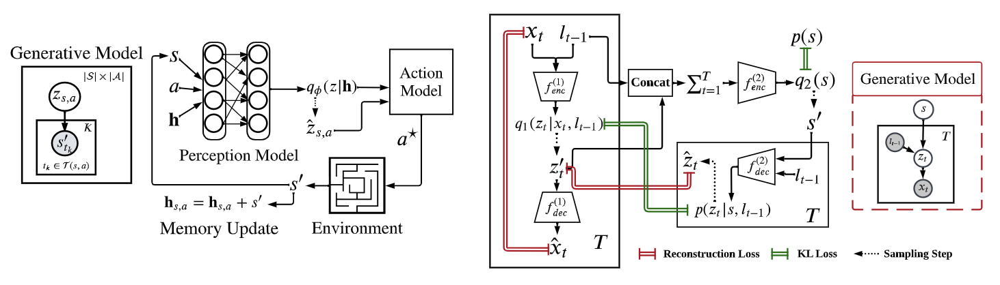

# Active Sensing with Predictive Coding and Uncertainty Minimization

by
Abdelrahman Sharafeldin,
Nabil Imam,
and Hannah Choi

This repository is the official implementation of our paper [Active Sensing with Predictive Coding and Uncertainty Minimization](https://arxiv.org/abs/2307.00668).

This paper has been submitted for publication in [Patterns](https://www.cell.com/patterns/home).

In this paper, we developed an end-to-end perception-action framework for embodied exploration based on two theories from computational neuroscience: predictive coding for perception and uncertainty minimization for action. We apply this framework to two exploration settings: discrete-action Controllable Markov Chains (CMCs), and continuous-action active vision tasks. 

*Generative models and architectures for the active exploration agents in CMCs (left) and active vision (right). In both cases, the perception model aims to optimize the ELBO of a generative model that reflects the nature of the task, while the action model selects actions in an intrinsically-motivated manner to minimize the uncertainty of the perception model.*

## Abstract

We present an end-to-end procedure for embodied exploration inspired by two biological computations: predictive coding and uncertainty minimization. The procedure can be applied to exploration settings in a task-independent and intrinsically driven manner. We first demonstrate our approach in a maze navigation task and show that it can discover the underlying transition distributions and spatial features of the environment. Second, we apply our model to a more complex active vision task, where an agent actively samples its visual environment to gather information. We show that our model builds unsupervised representations through exploration that allow it to efficiently categorize visual scenes. We further show that using these representations for downstream classification leads to superior data efficiency and learning speed compared to other baselines while maintaining lower parameter complexity.  Finally, the modularity of our model allows us to probe its internal mechanisms and analyze the interaction between perception and action during exploration.

## Software implementation

All code is written in Python using [PyTorch](pytroch.org). Our active sensing algorithms for CMC exploration and active vision are implemented in the `agents` folder. All tasks are implemented as [Gym](https://www.gymlibrary.dev/index.html) environments and are included in the `envs` folder. All components of our CMC exploration agent are in one file [`agents/cmc_explorer`](./agents/cmc_explorer.py). The components of the active vision model are implemented in the `models` folder. Scripts used to train the various models in baselines are included in the `scripts` folder.

## Getting the code

You can download a copy of all the files in this repository by cloning the
[git](https://git-scm.com/) repository:

    git clone https://github.com/AbdoSharaf98/active-sensing-paper.git

or [download a zip archive](https://github.com/AbdoSharaf98/active-sensing-paper/archive/refs/heads/main.zip).

> A copy of the repository is also archived at *insert DOI here*

## Dependencies

You'll need a working Python environment to run the code.
The recommended way to set up your environment is through the
[Anaconda Python distribution](https://www.anaconda.com/download/) which
provides the `conda` package manager.
Anaconda can be installed in your user directory and does not interfere with
the system Python installation.
The required dependencies are specified in the file `environment.yml`.

We use `conda` virtual environments to manage the project dependencies in
isolation.
Thus, you can install our dependencies without causing conflicts with your
setup (even with different Python versions).

Run the following command in the repository folder (where `environment.yml`
is located) to create a separate environment and install all required
dependencies in it:

    conda env create -f environment.yml

Alternatively, we also provide a `requirements.txt` file which you can use to install the dependencies with `pip` by running:

    pip install -r requirements.txt

## Creating and training models

To create and run CMC exploration agents with BAS, Boltzmann, and Random action strategies, run the command
    python -m scripts.run_cmc_explorer --env maze --verbose --total_steps 3000
This will create and run the three agents in the maze environment for a total of 3000 time steps. By specifiying the `--verbose` argument, the script will also print the learning progress and number of visited states throughout the episode, similar to Figure 4 in the paper. The hyperparameters for the models and the environments can be specified in the [`cmc.yml`](./configs/cmc.yml) config file in the `configs` folder. If no `--config_dir` argument is specified, this is the default config file used by the script.

## Reproducing the results

Before running any code you must activate the conda environment:

    source activate ENVIRONMENT_NAME

or, if you're on Windows:

    activate ENVIRONMENT_NAME

This will enable the environment for your current terminal session.
Any subsequent commands will use software that is installed in the environment.

To build and test the software, produce all results and figures, and compile
the manuscript PDF, run this in the top level of the repository:

    make all

If all goes well, the manuscript PDF will be placed in `manuscript/output`.

You can also run individual steps in the process using the `Makefile`s from the
`code` and `manuscript` folders. See the respective `README.md` files for
instructions.

Another way of exploring the code results is to execute the Jupyter notebooks
individually.
To do this, you must first start the notebook server by going into the
repository top level and running:

    jupyter notebook

This will start the server and open your default web browser to the Jupyter
interface. In the page, go into the `code/notebooks` folder and select the
notebook that you wish to view/run.

The notebook is divided into cells (some have text while other have code).
Each cell can be executed using `Shift + Enter`.
Executing text cells does nothing and executing code cells runs the code
and produces it's output.
To execute the whole notebook, run all cells in order.

## License

All source code is made available under a BSD 3-clause license. You can freely
use and modify the code, without warranty, so long as you provide attribution
to the authors. See `LICENSE.md` for the full license text.

The manuscript text is not open source. The authors reserve the rights to the
article content, which is currently submitted for publication in the
JOURNAL NAME.
